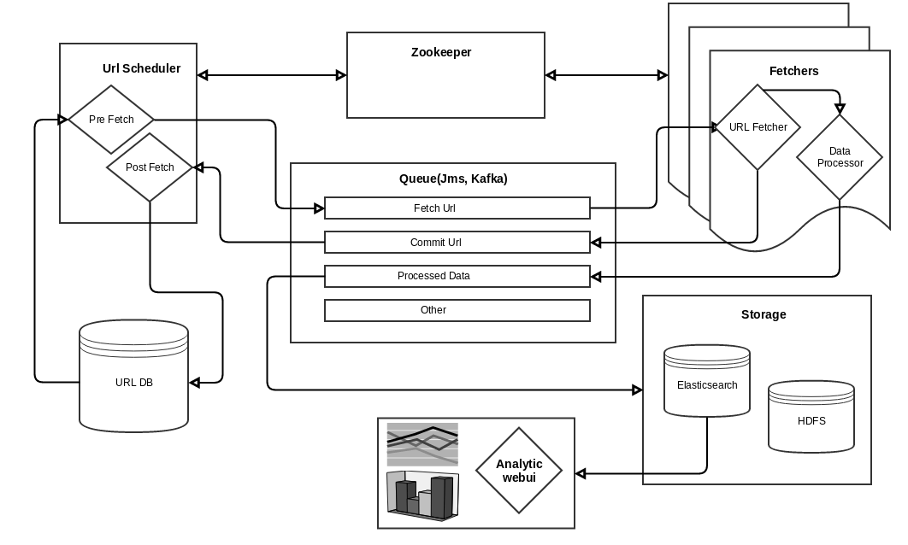

DataTP
======
1. [Overview](##overview)
2. [Data Tools](##Data Tools)
3. [Web Crawler](##Web Crawler)
4. [Facebook Data](##Facebook Data)
5. [Log Data](##Log Data)
6. [Other Data](##Other Data)
7. [DataTP System](##DataTP System)
8. [DataTP Design And Code Structure](##DataTP Design And Code Structure)
9. [Work With DataTP](##Work With DataTP)

##Overview##

The DataTP - Data Tool Platform - is an opensource data framework that allow the developer to capture the different type of data such webpage, facebook data, log data... Process the data by the data tool to extract the entities, classify the data... and then forward the data to a queue to further save the data to elasticsearch for analysis or other storage such HDFS for backup.

The main goals of the project are:

1. Scalable and reliable
2. Reuse as much as possible the other popular opensource project such spring framework, elasticsearch, zookeeper, kafka, hadoop...
3. Implement the missing data lib or services such data lib, web crawler, facebook data feeder...
4. Integrate the data components and other opensources into an usable data analytic product. 
5. Implement a webui to monitor, control and analyze the data.

##Data Tools##

The Data tool is the library for the processing of text and xhtml. 

The xhtml tool is based on the jsoup lib and boilerpipe lib. It allow to extract the data from xhtml by xpath or  extract the title, description, content automatically by using boilerpipe lib

The main features of the text tool are:

- Segment the text into sentences, token...
- Analyze token and classify the token as word, digit, number, email, phone number, currency...
- The text tool is designed to use with the other text tool or NLP tool.

##Web Crawler##

The web crawler is designed to be scalable and distributed. The crawler consists of the main components:

1. The url database is designed to be small and fast, so a single urldb can handle up to 1Billion of urls. Usually 1 url record takes about 300 bytes, 1 billion records result 300GB, but if we use the data compression it will be about 30 - 50GB.
1. The queue is used to etablish a reliable connection between url scheduler, url fetchers and the data processor components.
2. The url scheduler periodically traverse the entire urldb, find the url that meet the criteria such new url, expired url... to schedule for fetching. It also take the url that has beed fetched from the queue or new detect url and save to the url db.
4. the url fetchers take the url that is scheduled for fetching from the queuei, fetch the url, forward the url with the fetched data to the data processor for processing such detect the web page type(page list, detail, ignore...), extract the data by xpath, automation algorithm or other plugin. The processed data and url then save to the queue for commit or further processing by the other components. 
5. the xhtml processor is designed with plugin to do certain job such classification, extraction...
6. In the distributed crawler implementation, the zookeeper is used to communicate and coordinate between the sheduler and fetchers.

##Facebook Data Feeder##

##Log Data Feeder##

##Other Data Feeder##

##DataTP Design And Code Structure

###Lib###

The lib directory contain the other sub library project, they are:

1. utils is a project that contains the reusable classes to handle text, io, util...
2. xhtml is a project that extends the jsoup and boilerpipe project to handle the xhtml extraction.
3. nlp is a project that help segment text, identify the different type of token such word, digit, number, email, url, currency, phone numbers, date... The nlp lib also has a custom matcher frame work that allow to extract the complex entity such address, complex date format...

###module###

DataTP is heavily used and depended on the other popular opensource framework, the module contains the sub projects that are the wrapper or resusable classes to those framework. Usually, each project implement a wrapper service so the original service can be deployed as embedded service in the spring container or as an independant service and run in its own jvm.

The goal of the embedded services is to allow to integrate all the services and run in a single JVM. It is quite convenient a small scale deployment or unit testing.

1. commons project define some common api, implement some common and reusable service such system, memory, cpu... monitor.
2. spring-framework define some api, implement some example to show how to implement and deploy a service via microboot service or how to integrate via queue and integration channel. 
3. jms project implement an embedded jms service on top of activemq, define some api for jms channel integration, some examples.
4. zookeeper project implement an embbeded zookeeper service, implement some registry api on top of the zookeeper curator project.
5. elasticsearch project implement an embbeded elasticsearch service, some wrapper elasticsearch client classes for reusabilities and testing.

###data###

1. data/storage/batchdb 
2. data/feed/webcrawler
3. data/feed/facebook

###webui###

###release###

##Work With DataTP
