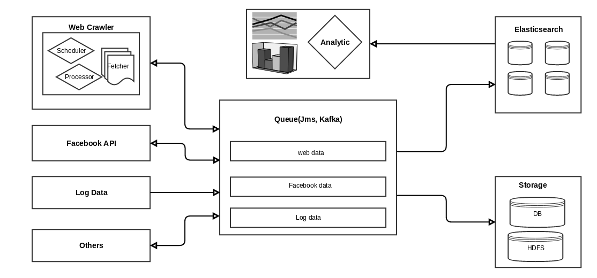

DataTP
======
1. [Overview](##overview)
2. [Data Tools](##Data Tools)
3. [Web Crawler](##Web Crawler)
4. [Facebook Data](##Facebook Data)
5. [Log Data](##Log Data)
6. [Other Data](##Other Data)
7. [DataTP System](##DataTP System)

##Overview##

The DataTP - Data Tool Platform - is an opensource data framework that allow the developer to capture the different type of data such webpage, facebook data, log data... Process the data by the data tool to extract the entities, classify the data... and then forward the data to a queue to further save the data to elasticsearch for analysis or other storage such HDFS for backup.

The main goals of the project are:

1. Scalable and reliable
2. Reuse as much as possible the other popular opensource project such spring framework, elasticsearch, zookeeper, kafka, hadoop...
3. Implement the missing data lib or services such data lib, web crawler, facebook data feeder...
4. Integrate the data components and other opensources into an usable data analytic product. 
5. Implement a webui to monitor, control and analyze the data.

##Data Tools##

The Data tool is the library for the processing of text and xhtml. 

The xhtml tool is based on the jsoup lib and boilerpipe lib. It allow to extract the data from xhtml by xpath or  extract the title, description, content automatically by using boilerpipe lib

The main features of the text tool are:

- Segment the text into sentences, token...
- Analyze token and classify the token as word, digit, number, email, phone number, currency...
- The text tool is designed to use with the other text tool or NLP tool.

##Web Crawler##

##Facebook Data Feeder##

##Log Data Feeder##

##Other Data Feeder##

##DataTP System##
