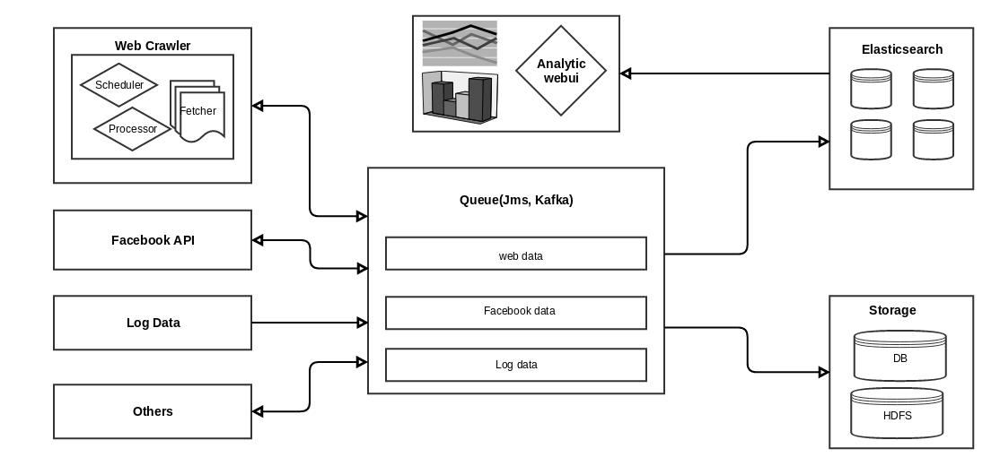

DataTP
======
1. [Overview](##overview)
2. [Web Crawler](##Web Crawler)
3. [Facebook Data](##Facebook Data)
4. [Log Data](##Log Data)
5. [Other Data](##Other Data)
6. [Data Tools](##Data Tools)
7. [DataTP System](##DataTP System)

##Overview##

The DataTP - Data Tool Platform - is a data framework that allow the developer/admin to capture the different type of data such webpage, facebook messages, log...

##Web Crawler##

##Facebook Data##

##Log Data##

##Other Data##

##Data Tools##
##DataTP System##
